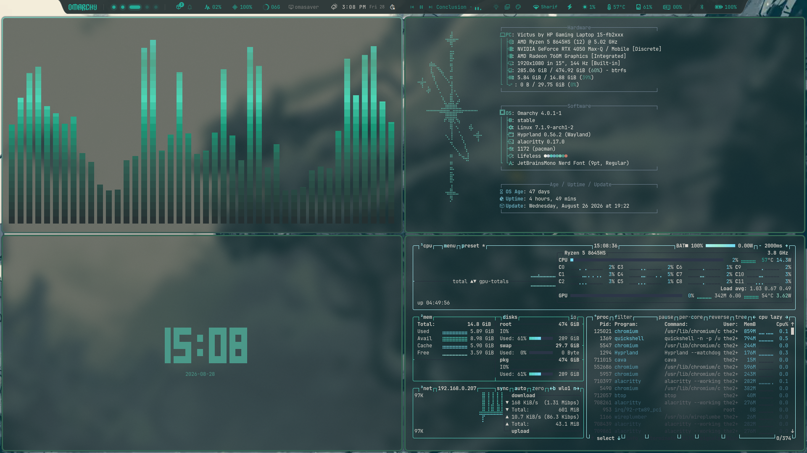
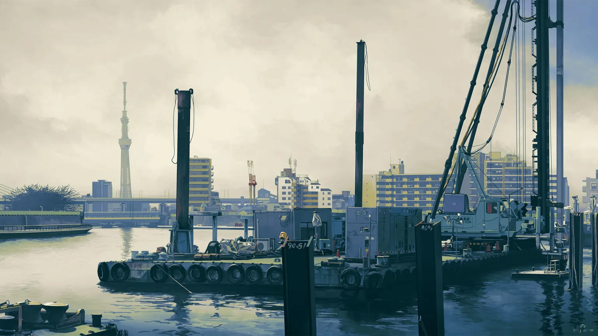
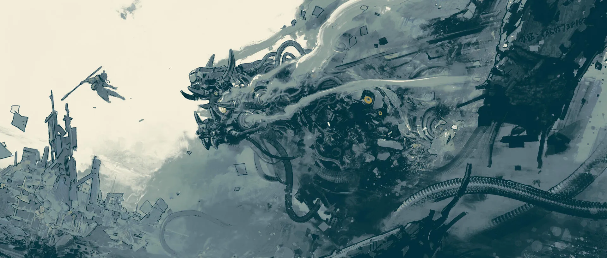
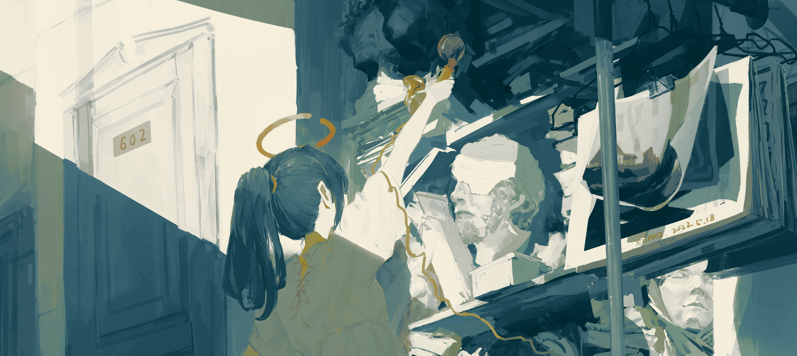

<div align="center">

<br/>

# 🌊 Lifeless

**A quiet, deep-water Omarchy theme.**  
Deep slate base · Mint & seafoam accents · Cool blue palette

<br/>


<br/>

</div>

---



---

## Colors

<div align="center">

|  | Role | Hex |
|:---:|:---|:---|
|  | Background | `#243031` |
|  | Foreground | `#dcd6ce` |
|  | Accent | `#abfeff` |
|  | Red (Mint) | `#55D8C5` |
|  | Green (Seafoam) | `#4CD5B5` |
|  | Yellow (Deep Teal) | `#23AC97` |
|  | Cyan | `#77e0f8` |
|  | Magenta (Ice Blue) | `#abf6fd` |
|  →  | Border Gradient | `#7EC2B2 → #294842` |

</div>

---

## What's included

| File | What it themes |
|:---|:---|
| `colors.toml` | Master palette — source of truth for colors and global surface configs |
| `alacritty.toml` | Alacritty terminal — colors, sage/slate ANSI palette, opacity config |
| `neovim.lua` | Neovim syntax colors via aether.nvim |
| `shell.toml` | Omarchy shell surfaces — bar, launcher, menus, popups, notifications |
| `shell.lock.toml` | Lock screen widget tokens |
| `hyprlock.conf` | Hyprlock lock screen colors |
| `starship.toml` | Starship shell prompt colors |
| `vencord.theme.css` | Discord theme via Vencord |
| `chromium.theme` | Chromium / Chrome browser titlebar color |
| `icons.theme` | Icon pack theme |
| `cava/config` | cava audio visualizer gradient |

---
## Backgrounds





---

## Install

```bash
# Copy the theme into Omarchy's themes directory
omarchy theme install https://github.com/themiddlechildreal/omarchy-lifeless-theme.git
```

---

> **cava note:** For the cava theme to take effect, remember to symlink your config:
> ```bash
> ln -sf ~/.local/state/omarchy/current/theme/cava/config ~/.config/cava/config
> ```

---

## Customizing

### Changing a color

1. Open `colors.toml` — this is the source of truth.
2. Change the hex value you want.
3. Mirror the change in application configs (like `alacritty.toml`) if overriding defaults.
4. Re-apply: `omarchy theme set lifeless`

### Terminal Opacity & Blur

Starting with the Quattro update, core settings like terminal opacity are handled globally or set inside `colors.toml`:

```toml
terminal_opacity = 0.82
terminal_blur = true
terminal_blur_radius = 28
```

You can also adjust standalone opacity inside `alacritty.toml`:
```toml
[window]
opacity = 0.60
```

### Changing window borders

Border gradients are defined directly in `colors.toml`:

```toml
# Muted teal → deep slate gradient
hyprland_active_border   = "#7EC2B2 #294842 45deg"
hyprland_inactive_border = "#2c3547"
```

## Things to remember

```
Since the Quattro update, themes do not install with hyprland.lua or terminal configs like alacritty.toml by default.
For more information, check out oldjobobos post on GitHub: https://github.com/basecamp/omarchy/pull/8720

If you wish to configure Fastfetch colors, edit the colors in alacritty.toml directly rather than colors.toml.
Border colors configured in hyprland or colors.toml only affect application windows, not system launcher or menu panels.
```

---

## Aesthetic

Lifeless is built around a calm, teal greenish atmosphere. The deep slate base (`#243031`) provides a muted foundation that avoids harsh black contrasts, while pale sage-white foreground text (`#dcd6ce`) reduces eye strain during prolonged sessions. 

Rather than bright standard primaries, the hue selection utilizes soft teals (`#23AC97`), seafoam (`#4CD5B5`), and mint (`#55D8C5`), accented by an icy cyan highlight (`#abfeff`). The overall look mimics still, deep water—cool, desaturated, and completely free of visual distractions.

---

<div align="center">

Made for [Omarchy Quattro](https://github.com/basecamp/omarchy) · by [@themiddlechildreal](https://github.com/themiddlechildreal)

</div>
